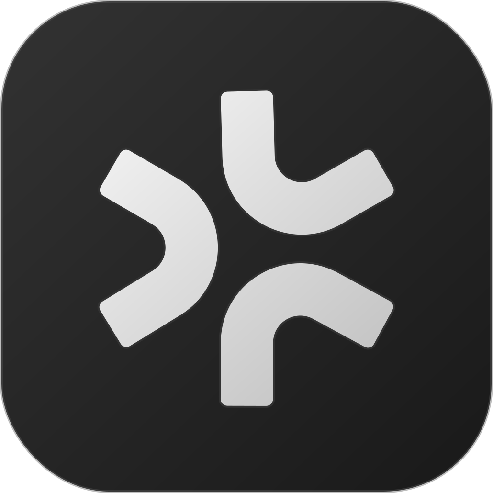

<p align="center" style="margin-bottom: 0.75em;">
  
</p>

<h1 align="center" style="margin-top: 0.25em; margin-bottom: 0.5em; font-size: 2.5em; font-weight: 700; letter-spacing: -0.02em;">Vexa</h1>

<p align="center" style="font-size: 1.75em; margin-top: 0.5em; margin-bottom: 0.75em; font-weight: 700; line-height: 1.3; letter-spacing: -0.01em;">
  <strong>Open-source meeting bot API & transcription API</strong>
</p>

<p align="center" style="font-size: 1em; color: #a0a0a0; margin-top: 0.5em; margin-bottom: 1.5em; letter-spacing: 0.01em;">
  meeting bots • real-time transcription • interactive bots • MCP server • self-hosted
</p>

<p align="center" style="margin: 1.5em 0; font-size: 1em;">
   <strong style="font-size: 1em; font-weight: 600;">Google Meet</strong>
  &nbsp;&nbsp;&nbsp;&nbsp;•&nbsp;&nbsp;&nbsp;&nbsp;
   <strong style="font-size: 1em; font-weight: 600;">Microsoft Teams</strong>
  &nbsp;&nbsp;&nbsp;&nbsp;•&nbsp;&nbsp;&nbsp;&nbsp;
   <strong style="font-size: 1em; font-weight: 600;">Zoom</strong>
</p>

<p align="center" style="margin: 1.75em 0 1.25em 0;">
  <a href="https://github.com/Vexa-ai/vexa/stargazers"></a>
  &nbsp;&nbsp;&nbsp;
  <a href="LICENSE"></a>
  &nbsp;&nbsp;&nbsp;
  <a href="https://discord.gg/Ga9duGkVz9"></a>
</p>

<p align="center">
  <a href="#whats-new">What's new</a> •
  <a href="#quickstart">Quickstart</a> •
  <a href="#meeting-api--send-bots-get-transcripts">API</a> •
  <a href="https://docs.vexa.ai">Docs</a> •
  <a href="#roadmap">Roadmap</a> •
  <a href="https://discord.gg/Ga9duGkVz9">Discord</a>
</p>

---

**Vexa** is an open-source, self-hostable meeting bot API and meeting transcription API for Google Meet, Microsoft Teams, and Zoom. Alternative to Recall.ai, Otter.ai, and Fireflies.ai — self-host so meeting data never leaves your infrastructure, or use [vexa.ai](https://vexa.ai) hosted.

---

**Data sovereignty** — self-host so meeting data never leaves your infrastructure

**Cost** — replace $20/seat SaaS with your own infrastructure

**Embed in your product** — multi-tenant meeting bot API with scoped tokens

**AI agents** — MCP server with 17 tools

---

### Capabilities


| | |
| --- | --- |
| **Meeting bot API** | Send a bot to any meeting: auto-join, record, speak, chat, share screen. Open-source alternative to [Recall.ai](https://recall.ai). |
| **Meeting transcription API** | Real-time transcripts via REST API and WebSocket. Self-hosted alternative to Otter.ai and Fireflies.ai. |
| **Real-time transcription** | Sub-second per-speaker transcripts during the call. 100+ languages via Whisper. WebSocket streaming. |
| **Interactive bots** | Make bots speak, send/read chat, share screen content, and set avatar in live meetings. |
| **Browser bots** | CDP + Playwright browser automation with persistent authenticated sessions via S3. |
| **MCP server** | 17 meeting tools for Claude, Cursor, Windsurf. AI agents join calls, read transcripts, speak in meetings. |
| **Multi-tenant** | Users, scoped API tokens, isolated containers. Deploy once, serve your team. |
| **Dashboard** | Open-source Next.js web UI — meetings, transcripts, agent chat, browser sessions. Ready to use out of the box. |
| **Self-hostable** | Run on your infra. Meeting data never leaves your infrastructure. |


Every feature is a separate service. Pick what you need, skip what you don't. Self-host everything or use [vexa.ai](https://vexa.ai) hosted.

---

## Why Self-Host Meeting Transcription?

**For regulated industries** — banks, financial services, healthcare — meeting data can't leave your infrastructure. Self-hosting Vexa means zero external data transmission and full audit trail on your own infrastructure.

**For cost-conscious teams** — replace per-seat SaaS pricing. A team paying $17/seat/mo for meeting transcription can self-host Vexa and drop that to infrastructure cost.

**For developers** — embed a meeting bot API in your product. Multi-tenant, scoped API tokens, no per-user infrastructure.

Build meeting assistants like Otter.ai, Fireflies.ai, or Fathom — or build a meeting bot API like [Recall.ai](https://recall.ai) — self-hosted on your infrastructure.

- **Vexa (self-host)** — your infra cost. Data never leaves your infrastructure. Meeting bot API, real-time transcription, interactive bots, MCP server. Open source, Apache 2.0. Google Meet, Teams, Zoom*.
- **Recall.ai** — $0.50/hr. No self-hosting. Meeting bot API, real-time transcription. No MCP, limited interactive bots. Closed source. Meet, Teams, Zoom, Webex.
- **Otter.ai** — $17-20/seat/mo. No self-hosting. No API. Limited real-time transcription. Closed source. Meet, Teams, Zoom.

\* Zoom support is experimental

Or use [vexa.ai](https://vexa.ai) hosted — get an API key and start sending bots immediately, no infrastructure needed.

## Built for Data Sovereignty

Meeting data never leaves your infrastructure. Self-host for complete control. Modular architecture scales from edge devices to millions of users.

**1. Hosted service**
At [vexa.ai](https://vexa.ai) — get an API key and start sending bots. No infrastructure needed.
*Ready to integrate*

---

**2. Self-host with Vexa transcription**
Run Vexa yourself, use vexa.ai for transcription — ready to go, no GPU needed.
*Control with minimal DevOps* — see [deploy/](./deploy/) for setup guides.

---

**3. Fully self-host**
Run everything including your own GPU transcription service.
*Meeting data never leaves your infrastructure* — see [deploy/](./deploy/) for setup guides.

## What's new

**v0.10 — full architecture refactor**

- **Services refactored** — runtime-api as infrastructure layer (container orchestration), meeting-api as data layer, agent-api as high-level intelligence layer. Clean separation of concerns.
- **Real-time pipeline moved into bots** — transcription pipeline now runs inside bot containers, eliminating external dependencies
- **Agent API** *(experimental)* — ephemeral containers for AI agents. See [services/agent-api/](./services/agent-api/).
- **Helm/K8s** — production Kubernetes deployment with built images and global.imageTag support

**v0.9**

- **Zoom** *(experimental)* — initial Zoom Meeting SDK support
- **Interactive Bots API** — speak, chat, screen share, avatar controls during live meetings
- **MCP server** — 17 tools for AI agents
- **Recordings** — S3-compatible storage

---

> See full release notes: [https://github.com/Vexa-ai/vexa/releases](https://github.com/Vexa-ai/vexa/releases)

---

## Quickstart

### Self-host with Docker

On a fresh Linux machine (Ubuntu 24.04):

```bash
apt-get update && apt-get install -y make git curl
curl -fsSL https://get.docker.com | sh
git clone https://github.com/Vexa-ai/vexa.git && cd vexa
```

Then choose:


| Command      | What you get                     | Best for                    |
| ------------ | -------------------------------- | --------------------------- |
| `make lite`  | Single container, all services   | Quick evaluation, small teams |
| `make all`   | Full stack, each service separate | Development, production     |


Both prompt for a transcription token on first run. Get one at [staging.vexa.ai/dashboard/transcription](https://staging.vexa.ai/dashboard/transcription), or [self-host transcription](./services/transcription-service/README.md) with a GPU.

Guides: [Vexa Lite](deploy/lite/README.md) | [Docker Compose](deploy/compose/README.md) | [Helm (K8s)](deploy/helm/README.md)

### Hosted (no deployment needed)

Get your API key at [vexa.ai/dashboard/api-keys](https://vexa.ai/dashboard/api-keys) and start sending bots immediately.

## Meeting API — Send Bots, Get Transcripts

Send a bot, get real-time transcripts with per-speaker audio and interactive controls (speak, chat, share screen).

```bash
# Send a bot to Google Meet
curl -X POST "$API_BASE/bots" \
  -H "Content-Type: application/json" \
  -H "X-API-Key: <API_KEY>" \
  -d '{"platform": "google_meet", "native_meeting_id": "abc-defg-hij"}'

# Get transcripts
curl -H "X-API-Key: <API_KEY>" \
  "$API_BASE/transcripts/google_meet/abc-defg-hij"
```

Works with Google Meet, Microsoft Teams, and Zoom. Set `API_BASE` to `https://api.cloud.vexa.ai` (hosted) or `http://localhost:8056` (self-hosted).

For real-time WebSocket streaming, see the [WebSocket guide](https://docs.vexa.ai/websocket). For full REST details, see the [User API Guide](https://docs.vexa.ai/user_api_guide).

---

## Browser Bots — Persistent Browser Containers for Agents

Remote browser containers with CDP + Playwright access and persistent session storage via S3. Agents get a real browser that stays logged in across restarts — Google, Microsoft, or any web session.

- **CDP + Playwright** — full browser automation via Chrome DevTools Protocol
- **Persistent sessions** — authenticated browser state saved to S3, restored on next spin-up
- **VNC access** — humans can observe and control the browser in real time alongside agents
- **On-demand containers** — spin up in seconds, auto-reclaim when idle

See [features/browser-session/](./features/browser-session/) and [features/remote-browser/](./features/remote-browser/) for details.

---

## MCP Server — Meeting Tools for AI Agents

17 tools that let AI agents join meetings, read transcripts, speak, chat, and share screen. Works with Claude, Cursor, Windsurf, and any MCP-compatible client.

Your AI agent can join a meeting, listen to the conversation, and participate — all through MCP tool calls. See [services/mcp/](./services/mcp/) for setup and tool reference.

---

## Modular — Pick What You Need

Vexa is a toolkit, not a monolith. Every feature works independently. Use one or all — they compose when you need them to.


| You're building... | Features you need | Skip the rest |
| --- | --- | --- |
| **Self-hosted Otter replacement** | transcription + multi-platform + webhooks | agent runtime, scheduler, MCP |
| **Meeting data pipeline** | transcription + webhooks + post-meeting | speaking-bot, chat, agent runtime |
| **AI meeting assistant product** | transcription + MCP + speaking-bot + chat | remote-browser, scheduler |
| **Meeting bot API (like Recall.ai)** | multi-platform + transcription + token-scoping | agent runtime, workspaces |


You don't pay complexity tax for features you don't use. Each service is a separate container. Don't need agents? Don't run agent-api. Don't need TTS? Don't run tts-service. Services communicate via REST and Redis, not tight coupling.

---

## Roadmap

For the up-to-date roadmap and priorities, see GitHub Issues and Milestones. Issues are grouped by milestones to show what's coming next, in what order, and what's currently highest priority.

- Issues: [https://github.com/Vexa-ai/vexa/issues](https://github.com/Vexa-ai/vexa/issues)
- Milestones: [https://github.com/Vexa-ai/vexa/milestones](https://github.com/Vexa-ai/vexa/milestones)

> For discussion/support, join our [Discord](https://discord.gg/Ga9duGkVz9).

## Architecture & Feature Status

Each service and feature has its own README with architecture, DoD table, and evidence-based confidence scores.

- **Services:** [api-gateway](./services/api-gateway) • [meeting-api](./services/meeting-api) • [admin-api](./services/admin-api) • [runtime-api](./services/runtime-api) • [vexa-bot](./services/vexa-bot) • [transcription-service](./services/transcription-service) • [tts-service](./services/tts-service) • [mcp](./services/mcp) • [dashboard](./services/dashboard) • [agent-api](./services/agent-api) *(experimental)*
- **Features:** [realtime-transcription](./features/realtime-transcription) • [bot-lifecycle](./features/bot-lifecycle) • [browser-session](./features/browser-session) • [remote-browser](./features/remote-browser) • [speaking-bot](./features/speaking-bot) • [meeting-chat](./features/meeting-chat) • [webhooks](./features/webhooks) • [authenticated-meetings](./features/authenticated-meetings)
- **Deploy:** [Docker Compose](./deploy/compose) • [Vexa Lite](./deploy/lite) • [Helm/K8s](./deploy/helm)
- **Guides:** [Vexa Lite Deployment](https://docs.vexa.ai/vexa-lite-deployment) • [Docker Compose Deployment](https://docs.vexa.ai/deployment) • [Self-Hosted Management](https://docs.vexa.ai/self-hosted-management) • [Recording Storage](https://docs.vexa.ai/recording-storage)

---

## Contributing

We use **GitHub Issues** as our main feedback channel — triaged within **72 hours**. Look for `good-first-issue` to get started. Join [Discord](https://discord.gg/Ga9duGkVz9) to discuss ideas and get assigned.

[](LICENSE)

## Links

[Website](https://vexa.ai) • [Docs](https://docs.vexa.ai) • [Discord](https://discord.gg/Ga9duGkVz9) • [LinkedIn](https://www.linkedin.com/company/vexa-ai/) • [X (@grankin_d)](https://x.com/grankin_d) • [Meet Founder](https://www.linkedin.com/in/dmitry-grankin/)

**Related:** [vexa-lite-deploy](https://github.com/Vexa-ai/vexa-lite-deploy) • [Vexa Dashboard](./services/dashboard)
