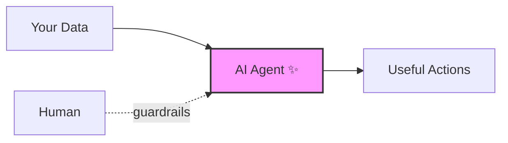
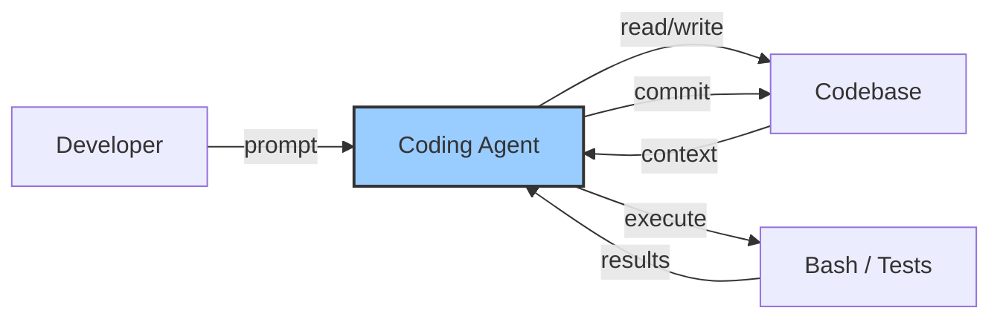
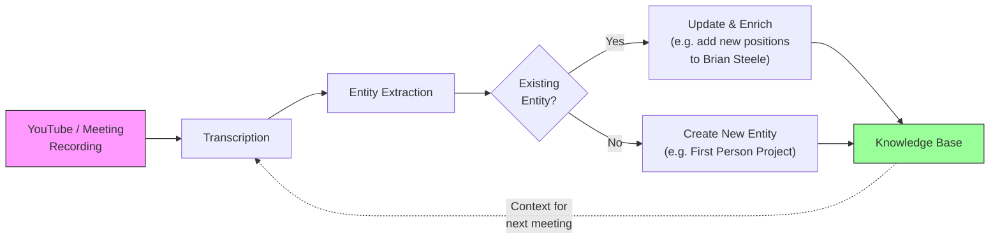
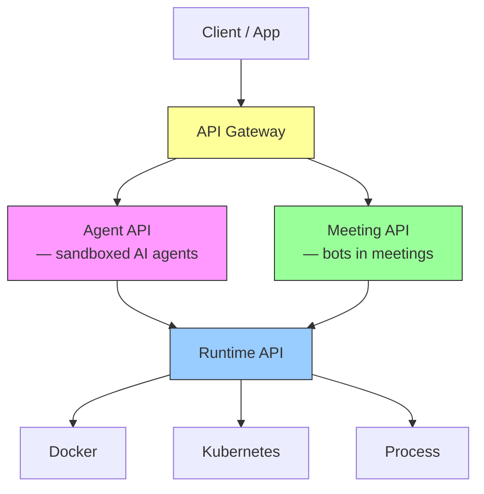
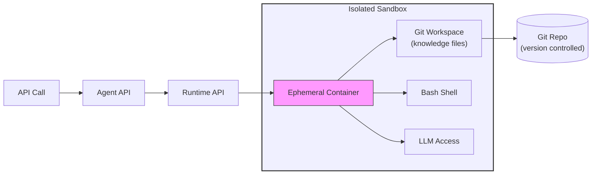
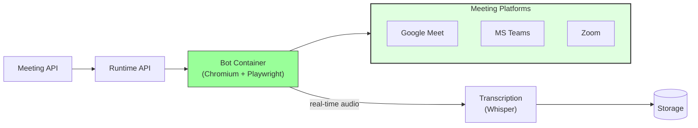
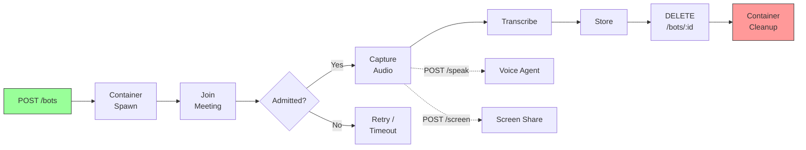
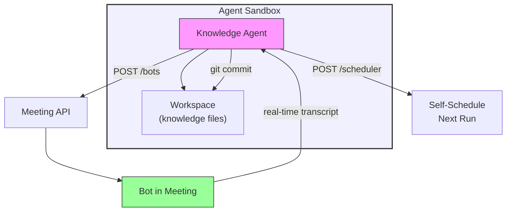
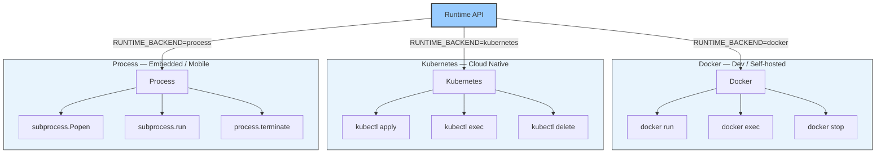
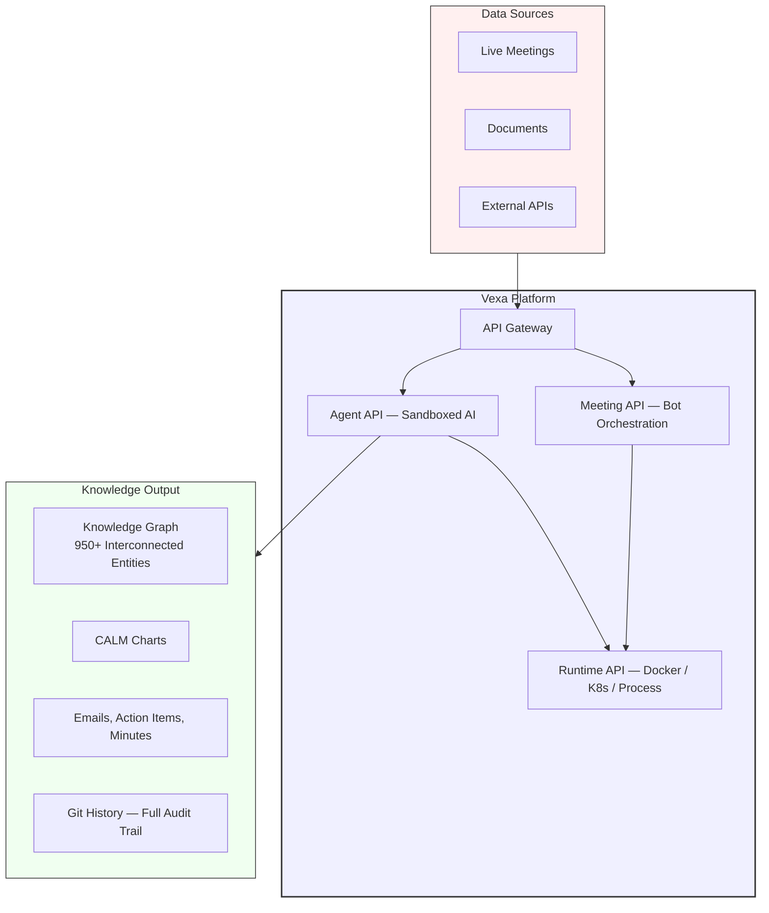

# Vexa: Enterprise-Ready Agent Infra for Real-World Tasks

> Open-source infrastructure to spawn, sandbox, and orchestrate AI agents — from meeting bots to knowledge engines.

---

# Part 1: The Dream vs. Reality

---

## The AI We All Imagine

A black box with data connectors that actually **does things** — under full human guardrails.



That's the vision. Here's the reality:

---

## The Reality: Garbage In, Garbage Out

LLMs are fundamentally **next-token predictors**. They're only as good as what you feed them.

Over the last few years, the industry accumulated a stack of techniques to bridge this gap:

| Technique | What it does | The gap it fills |
|---|---|---|
| **RAG** | Retrieves relevant documents | Context beyond training data |
| **Tool calling** | Lets LLMs invoke functions | Actions in the real world |
| **Agents** | Autonomous multi-step reasoning | Complex task execution |
| **Memory** | Persistent state across sessions | Continuity |

And now, I think the consensus is forming: **we have one proven success story.**

---

## One Domain Where It Actually Works: Code

Agentic AI has genuinely transformed software development.

**Claude Code. Codex. Cursor. Windsurf.**

These agents:
- Get **tooling access** to all the data they need (files, APIs, docs)
- Can **execute bash commands**, including manipulating files
- Have a **self-improvement loop** — agents own their own memory (at least in theory)

But what **is** an agent, really? Strip away the marketing:

```python
while not done:

    # LLM decides what to do
    action = llm(context, tools=[read, write, bash])

    # Execute and feed the result back
    context += execute(action)
```

A loop. An LLM. Tools. That's all an agent is.

The magic isn't the loop — it's **what tools** you give it and **what data** you point it at.



This works. Demonstrably. Shipping real production code, at scale, today.

But **why code?**

---

## Why Code? The Structure Question

LLMs are generic next-token predictors. They work on any text. So what makes code different from, say, a meeting transcription?

**Structure.**

| Property | Code | Meeting Transcript |
|---|---|---|
| **Structured** | Syntax, types, modules | Just a blob of text |
| **Concise** | Every token carries meaning | Filler, repetition, tangents |
| **Connected** | Imports, calls, references form a graph | Speaker + timestamp, nothing else |
| **Unambiguous** | One meaning per expression | Context-dependent, implicit |
| **Evaluable** | It runs or it doesn't. Boolean. | No objective success criteria |

Code has a built-in evaluation loop: **it either executes or it doesn't.** That's what makes agentic coding work — the agent gets immediate, objective feedback.

A meeting transcript? It's a blob of text with speaker and timestamp attribution. But it **contains** structure — structure that needs to be **inferred**.

---

## The Insight: You Don't Need a New Kind of Agent

Can we create a coding-like agentic loop that processes transcriptions into structured, "code-like" output?

**We don't even need to.** Coding agents already do this perfectly well.

They are **general text processors.** Claude Code doesn't care whether it's processing Python or markdown — it reads, reasons, writes, and commits. The question isn't "what agent?" — it's:

> **What is the initial structure design that will scaffold a knowledge engine?**

---

# Part 2: The Knowledge Machine

---

## The Structure: Simple and It Works

For a general business application, the scaffold is straightforward:

```
knowledge/
├── entities/
│   ├── contacts/      # People — customers, leads, VCs
│   ├── companies/     # Organizations — competitors, partners
│   └── products/      # Software products, integrations
│
├── outputs/
│   ├── emails/        # Drafted communications
│   ├── calm-charts/   # Architecture visualizations (FINOS CALM)
│   ├── meeting-minutes/
│   └── action-items/
│
└── README.md
```

Each entity is a **markdown file** with tags, structured fields, and `[[wiki-links]]` to other entities. The knowledge base is a **graph**, not a collection of documents.

---

## Real Example: A Contact

*Extracted automatically from a YouTube recording of a DTCC panel.*

```markdown
# Brian Steele

- **Title:** Executive Vice President (EVP)
- **Organization:** [[DTCC]]
- **Role:** Leader of DTCC's digital assets and tokenization strategy

## Key Positions
- Driving DTCC's evolution from traditional securities settlement
  to tokenized digital assets
- Secured SEC no action letter (late 2024) for tokenization
- "If trust in what we do fails, there's no sense in having
   DTCC as an organization"

## Related Entities
- [[DTCC]] — Organization
- [[Joe Lubin]] — ConsenSys counterpart in dialogue
- [[Rob Palatnik]] — DTCC predecessor (blockchain since Jan 2016)
```

---

## Real Example: A Company

```markdown
# DTCC

- **Full Name:** Depository Trust & Clearing Corporation
- **Industry:** Financial Services, Securities Settlement
- **Assets under custody:** $100+ trillion in US equities

## Tokenization Initiative
- Enable tokenization of $100T in assets
- Multi-Layer 1 integration (not locked to single blockchain)
- "Compliant-aware tokens" maintaining KYC/AML standards

## Representatives
- [[Brian Steele]] — EVP, digital assets strategy
- [[Rob Palatnik]] — Early blockchain champion (2016+)

## Related Entities
- [[ConsenSys]] — Technology partner
- [[SWIFT]] — Collaborator on ledger infrastructure
- [[Ethereum]] — One of multiple L1 networks
```

---

## Real Example: A Product

```markdown
# First Person Project

- **Description:** Decentralized trust credentials for Linux kernel
  and system verification
- **Maintained by:** [[Linux Foundation]] + [[Trust Over IP]]

## Key Demonstration
- Human Agency Summit (H2) Demo: Feb 23, 2026
- Presenters: [[Drummond Reed]], [[Jim Zen]]

## Related Entities
- [[Trust Over IP]] — Standards and credential source
- [[Linux Foundation]] — Platform and support
```

Tags for discovery. `[[wiki-links]]` for navigation. Structured sections for consistent parsing by both humans and agents.

**Do these names look familiar?** All of this was extracted automatically from public YouTube recordings.

---

## Real Example: A Meeting

*From a 1-hour YouTube recording — auto-extracted into structured knowledge.*

```markdown
# Brian Steele (DTCC) & Joe Lubin (ConsenSys) in Conversation

**Date:** 2024-09-20
**Recording:** youtube.com/watch?v=BaCbGynWP7g

## TL;DR
[[Brian Steele]] (DTCC) and [[Joe Lubin]] (ConsenSys) discuss
a decade of blockchain adoption in traditional finance.
DTCC's tokenization initiative, SWIFT ledger development,
and AI agents with decentralized protocols.

## Key Decisions
- DTCC will enable $100T in asset tokenization
- Multi-chain strategy: no lock-in to single L1
- Partnership model, not unilateral expansion
- Human agency must underpin AI innovation

## Action Items
- [[Brian Steele]]: continue multi-L1 integration strategy
- [[Joe Lubin]]: advance decentralized AI agent protocols
- Summit on Human Agency: Feb 23 (LF Decentralized Trust)
```

---

## Real Example: Action Items

*Auto-extracted from Trust Over IP Steering Committee (2026-02-11).*

```markdown
| # | Action | Owner | Status |
|---|--------|-------|--------|
| 1 | Mint DOIs for Kerry Suite v1.0 via Zenoto | [[Carly]] | Open |
| 2 | Lead specupt template development | [[Drummond Reed]] | Open |
| 3 | Provide ISO liaison guidance | [[Carla]] | Open |
| 4 | Disseminate LFDT mentorship info | Steering Committee | Open |
| 5 | Organize standards affiliations discussion | [[Scott]] | Open |
```

Every `[[wiki-link]]` connects to an entity. Every entity connects to meetings. Every meeting connects to action items. **It's a graph.**

---

## The Engine: How Knowledge Gets Built



A coding agent (like Claude Code) receives the transcript + existing knowledge, and produces structured entity updates — the same way it would refactor code.

---

## The Dataset

**Input:** 10 public YouTube recordings from the FINOS / LF Decentralized Trust ecosystem. No other data source — just the recordings.

| # | Recording | Event / Series | Date |
|---|---|---|---|
| 1 | [Brian Steele (DTCC) & Joe Lubin (ConsenSys)](https://www.youtube.com/watch?v=BaCbGynWP7g) | FSI Foundation | 2024-09-20 |
| 2 | [US Government and Stablecoins](https://www.youtube.com/watch?v=dgA3GONzYCs) | FM SIG | 2024-05-17 |
| 3 | [Blockchain, AI & Mortgage (MISMO)](https://www.youtube.com/watch?v=UUjv0h0YxwE) | Hyperledger FM Subgroup | 2024-06-14 |
| 4 | [TAG Security: Compliance & Jamara](https://www.youtube.com/watch?v=zHIYYkItDnE) | TAG Security | 2025-12-10 |
| 5 | [TAG Security: Minder Demo](https://www.youtube.com/watch?v=uncIyQLKKko) | TAG Security | 2026-01-07 |
| 6 | TAG Security: General | TAG Security | 2026-01-14 |
| 7 | Fabric CoAP Gateway | LF Decentralized Trust | 2026-01-21 |
| 8 | [LF Decentralized Trust TAC](https://www.youtube.com/watch?v=...) | TAC | 2026-01-22 |
| 9 | LF Decentralized Trust TAC | TAC | 2026-02-05 |
| 10 | [Trust Over IP Steering Committee](https://www.youtube.com/watch?v=q7BemXqnCzs) | ToIP Steering Committee | 2026-02-11 |

---

## The Output

**From 10 recordings, the engine produced:**

| Category | Count | Examples |
|---|---|---|
| **Contacts** | 55 | Brian Steele, Joe Lubin, Drummond Reed, Rob Palatnik, Franklin Noll, Devin Caster |
| **Companies** | 36 | DTCC, ConsenSys, Trust Over IP, MISMO, Fannie Mae, Morgan Stanley, Coinbase, SWIFT |
| **Products** | 11 | Ethereum, C2PA, First Person Project, Minder, Zarf, Kerry Suite, ELDD |
| **Meetings** | 10 | Full structured summaries with TL;DR, agenda, discussion, decisions |
| **Action Items** | 10 | Tracked per meeting with owner, due date, status |

**Total: 122 interconnected entities, 10 meeting summaries, 10 action item sets.**

All auto-extracted. All interconnected via `[[wiki-links]]`. All from recordings you may have attended.

---

## Why It Compounds

Each recording makes the **next** one richer:

| Recording | Entities Before | What Happens |
|---|---|---|
| DTCC & ConsenSys panel | 0 | Created Brian Steele, Joe Lubin, DTCC, ConsenSys, tokenization concepts |
| US Government Stablecoins | ~15 | Added regulators (Maxine Waters, Pat Toomey), linked to DTCC's regulatory context |
| TAG Security meetings | ~50 | Security entities linked back to trust infrastructure from DTCC panel |
| Trust Over IP Steering Committee | ~80 | Drummond Reed, Kerry Suite, C2PA — all auto-linked to existing LF Decentralized Trust entity |

The 10th recording produces richer knowledge than the 1st — because it has 9 recordings of accumulated context.

**This is not summarization. This is knowledge graph construction.**

---

# Part 3: The Hard Problems

---

## "That's a Cool PoC, But..."

Knowledge extraction works. We proved it. But to make this real — in production, for real users — you hit two walls:

---

## Problem 1: Security

Agents need **full machine access** to do their job. Your Claude Code can access and manipulate anything on your machine if you let it.

- Agents are **non-deterministic** — they can do unexpected things
- Agents can be **triggered from outside** to cause damage — prompt injection, jailbreaks
- One compromised agent = **compromised infrastructure**
- No isolation between users' data

This isn't theoretical. This is the reason most enterprises won't deploy agentic AI today.

---

## Problem 2: Scalability

Gmail is scalable. A thing that needs an **entire machine** to work is not.

- One machine, one agent
- Can't serve multiple users simultaneously
- No resource limits or lifecycle management
- Can't scale horizontally

How do you turn a "one developer with Claude Code on their laptop" into a service that handles thousands of concurrent knowledge-building agents?

---

# Part 4: Vexa's Answer

---

## Three APIs, One Platform



---

## Agent API — Spawn an AI Agent in a Sandbox

The answer to security: **ephemeral, isolated containers.**



- **Ephemeral** — container fires up, does the job, dies. Fully scalable.
- **Isolated** — agent has full control inside the sandbox, but **cannot escape**
- **Workspace** — git-controlled files the agent updates. Human-in-the-loop via git diff.
- **Bash** — can do everything, integrate with anything
- **Scheduler** — agents can schedule themselves for future work

Think of it as **a simple API to spawn OpenAI Codex-like containers**, but for any task.

### Core API Calls

```bash
# 1. Chat with an agent (SSE streaming)
curl -N -X POST https://api.vexa.ai/api/chat \
  -H "X-API-Key: $API_KEY" \
  -H "Content-Type: application/json" \
  -d '{
    "user_id": "user-123",
    "message": "Process the latest meeting transcript and update the knowledge base",
    "session_id": "sess-abc"
  }'
# → Content-Type: text/event-stream
# data: {"type": "text_delta", "content": "I'll process the transcript..."}
# data: {"type": "tool_use", "name": "write_file", ...}
# data: {"type": "stream_end", "session_id": "sess-abc"}

# 2. Read the workspace (what the agent produced)
curl "https://api.vexa.ai/api/workspace/files?user_id=user-123" \
  -H "X-API-Key: $API_KEY"
# → {"files": ["entities/contacts/Brian Steele.md", "entities/companies/DTCC.md", ...]}

# 3. Read a specific entity
curl "https://api.vexa.ai/api/workspace/file?user_id=user-123&path=entities/contacts/Brian%20Steele.md" \
  -H "X-API-Key: $API_KEY"
# → {"path": "entities/contacts/Brian Steele.md", "content": "# Brian Steele\n\n- **Title:** EVP..."}
```

---

## Meeting API — Bots in Every Meeting

Agents need data. The Meeting API gives them **real-time access to conversations**.



- **Meeting bot** with real-time transcription
- **Full browser control** via Playwright — the agent can see and interact with the meeting
- Agents can **schedule bots** to join meetings and get real-time data access

### Core API Calls

```bash
# 1. Send a bot to a meeting
curl -X POST https://api.vexa.ai/bots \
  -H "X-API-Key: $API_KEY" \
  -H "Content-Type: application/json" \
  -d '{
    "platform": "google_meet",
    "native_meeting_id": "abc-defg-hij",
    "voice_agent_enabled": true,
    "language": "en"
  }'
# 201 Created
# → {
#     "id": 12345,
#     "platform": "google_meet",
#     "native_meeting_id": "abc-defg-hij",
#     "status": "joining",
#     "constructed_meeting_url": "https://meet.google.com/abc-defg-hij",
#     "created_at": "2026-03-31T10:00:00Z"
#   }

# 2. Make the bot speak (voice agent)
curl -X POST https://api.vexa.ai/bots/google_meet/abc-defg-hij/speak \
  -H "X-API-Key: $API_KEY" \
  -H "Content-Type: application/json" \
  -d '{
    "text": "Thanks for joining. I will be taking notes.",
    "provider": "openai",
    "voice": "alloy"
  }'
# 202 Accepted → {"message": "Speak command sent", "meeting_id": 12345}

# 3. Get live transcript
curl https://api.vexa.ai/transcripts/google_meet/abc-defg-hij \
  -H "X-API-Key: $API_KEY"
# → {
#     "id": 12345,
#     "platform": "google_meet",
#     "status": "active",
#     "segments": [
#       {"start": 0.0, "end": 5.2, "text": "Hello everyone", "speaker": "Brian Steele"},
#       {"start": 5.3, "end": 12.1, "text": "Let's discuss tokenization", "speaker": "Joe Lubin"}
#     ]
#   }

# 4. Stop the bot
curl -X DELETE https://api.vexa.ai/bots/google_meet/abc-defg-hij \
  -H "X-API-Key: $API_KEY"
# 202 Accepted → {"message": "Stop request accepted and is being processed."}
```

### Bot Lifecycle



---

## Combining the Blocks

The power is in **composition**. An agent can:

1. **Schedule a bot** to join a meeting via Meeting API
2. **Receive real-time transcripts** as the meeting happens
3. **Process the transcript** in its sandbox — extract entities, update the knowledge graph
4. **Draft follow-up emails** based on accumulated knowledge
5. **Schedule itself** for the next meeting

All ephemeral. All isolated. All scalable.



---

## "Cool, But Where's the DevOps?"

These are high-level APIs. They need infrastructure underneath. That's the **Runtime API** — the layer that makes containers actually work.

---

## Runtime API — The Infrastructure Layer



### Example: Spawn a Container

```bash
curl -X POST https://runtime.vexa.ai/containers \
  -H "Content-Type: application/json" \
  -d '{
    "profile": "agent",
    "user_id": "user-123",
    "callback_url": "https://api.vexa.ai/internal/callback",
    "metadata": {"session_id": "sess-abc"}
  }'
# 201 Created
# → {
#     "name": "agent-user-123-a1b2c3",
#     "profile": "agent",
#     "user_id": "user-123",
#     "status": "running",
#     "container_id": "d4e5f6...",
#     "ports": {"8080/tcp": {"HostIp": "0.0.0.0", "HostPort": "32100"}},
#     "created_at": 1711875600.0
#   }
```

### The Scaling Story

| Backend | Where | Scale |
|---|---|---|
| **Process** | Your laptop, a phone, an embedded device | Single machine |
| **Docker** | Self-hosted server, small team | 10s of containers |
| **Kubernetes** | Cloud-native, enterprise | Thousands of pods |

```
Phone App (Process) → Self-Hosted (Docker) → Cloud Native (Kubernetes)
```

**One API. Three backends. No code changes.** The same codebase runs everywhere.

---

# Closing

---

## What Makes This Different

This isn't another meeting transcription tool. This isn't another RAG pipeline.

This is **infrastructure for turning conversations into persistent, interconnected, machine-traversable knowledge** — with the same agentic loop that made coding agents work.

| What | How |
|---|---|
| **Knowledge, not summaries** | Structured entities with typed relationships, not text blobs |
| **Compounds over time** | Each conversation enriches the graph — the 900th is richer than the 1st |
| **Secure by design** | Ephemeral sandboxed containers, agents can't escape |
| **Scales from phone to cluster** | Process → Docker → Kubernetes, same API |
| **Human in the loop** | Git-controlled workspace, every change is reviewable |
| **Open source** | Apache 2.0, fully self-hostable |

---

## The Stack



**Open source. Apache 2.0. Self-hostable.**

[github.com/Vexa-ai/vexa](https://github.com/Vexa-ai/vexa)

---

## References

| Paper / Project | Key Insight |
|---|---|
| **KGGen** (Mo et al., 2025) — NeurIPS | LLM-based knowledge graph extraction with iterative entity deduplication |
| **KARMA** (Lu & Wang, 2025) — NeurIPS | 9 collaborative LLM agents for knowledge graph enrichment. 83% accuracy |
| **CALM** (FINOS/Morgan Stanley, 2025) | Architecture-as-Code: Nodes + Relationships + Metadata. 1,400+ deployments |
| **LLM-TEXT2KG** (4th ed., 2025) | International workshop on LLM-integrated knowledge graph generation |
| **Personal Knowledge Graphs** | Markdown + wiki-links + tags = implicit knowledge graph |
| **QMatSuite** | "Persistent scientific memory" — agents as transferable experts, not isolated tools |
